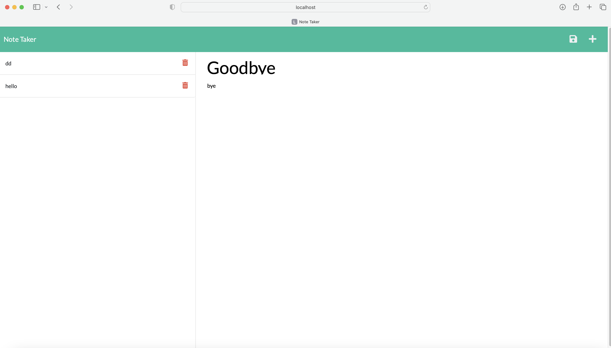

# Noted

# Technology Used 
JavaScript| HTML| CSS| Express

https://protected-spire-14767.herokuapp.com

## Description
The motivation behind this project was to create a website for small business owners to save notes and keep themselves organized. The front end of this project had already been given and I was tasked with connecting the front end and back end together.

## Usage
1. Visit the webpage link and click "Get Started"
2. You will be taken to the Note Taker page and be see a Note Title header. You can write a header for your notes and right below add some content into the "Note Text" section.
3. on the upper right hand corner a save icon will be populated after writing your first note. You can hit save and will see your  notes saved on th left hand column.
4. If you would like to write more notes hit the "+" icon next to the save button in the upper right corner.

## Installation
N/A

## Test
N/A

## License
N/A